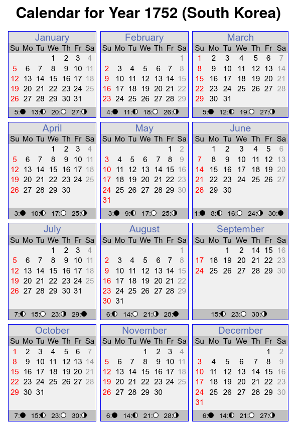

# korean_lunar_calendar
> Library to convert Korean lunar-calendar to Gregorian calendar.

## Overview
Korean calendar and Chinese calendar is same lunar calendar but have different date.
This follow the KARI(Korea Astronomy and Space Science Institute)
한국 양음력 변환 (한국천문연구원 기준) - 네트워크 연결 불필요
```
음력 지원 범위 (1000년 01월 01일 ~ 2050년 11월 18일)
Korean Lunar Calendar (1000-01-01 ~ 2050-11-18)

양력 지원 범위 (1000년 02월 13일 ~ 2050년 12월 31일)
Gregorian Calendar (1000-02-13 ~ 2050-12-31)
```
[Example Site](https://usingsky.github.io/korean_lunar_calendar_js)

## Docs

- [korean\_lunar\_calendar](#korean_lunar_calendar)
	- [Overview](#overview)
	- [Docs](#docs)
	- [Install](#install)
	- [Import](#import)
	- [Example](#example)
	- [Validation](#validation)
	- [Other languages](#other-languages)
	- [On Calendars](#on-calendars)
		- [Lunar Calendar](#lunar-calendar)
			- [Example: Chinese Lunar Calendar 2025](#example-chinese-lunar-calendar-2025)
		- [Julian to Gregorian Calendar: 1582?](#julian-to-gregorian-calendar-1582)
			- [France](#france)
			- [Korea](#korea)
		- [`datetime`](#datetime)
			- [Proleptic Gregorian Calendar](#proleptic-gregorian-calendar)
		- [Gapja: Zodiac](#gapja-zodiac)
			- [Symbols](#symbols)


## Install

```bash
pip install korean_lunar_calendar
```

## Import

```python
from korean_lunar_calendar import KoreanLunarCalendar
```

## Example

Korean Solar Date -> Korean Lunar Date (양력 -> 음력)

```python
calendar = KoreanLunarCalendar()

# params : year(년), month(월), day(일)
calendar.setSolarDate(2017, 6, 24)

# Lunar Date (ISO Format)
print(calendar.LunarIsoFormat())

# Korean GapJa String
print(calendar.getGapJaString())

# Chinese GapJa String
print(calendar.getChineseGapJaString())
```

```
[Result]
2017-05-01 Intercalation
정유년 병오월 임오일 (윤월)
丁酉年 丙午月 壬午日 (閏月)
```

Korean Lunar Date -> Korean Solar Date (음력 -> 양력)

```python
calendar = KoreanLunarCalendar()

# params : year(년), month(월), day(일), intercalation(윤달여부)
calendar.setLunarDate(1956, 1, 21, False)

# Solar Date (ISO Format)
print(calendar.SolarIsoFormat())

# Korean GapJa String
print(calendar.getGapJaString())

# Chinese GapJa String
print(calendar.getChineseGapJaString())
```

```
[Result]
1956-03-03
병신년 경인월 기사일
丙申年 庚寅月 己巳日
```

## Validation

Check for invalid date input

```python
calendar = KoreanLunarCalendar()

# invald date
calendar.setLunarDate(99, 1, 1, False) # => return False
calendar.setSolarDate(2051, 1, 1) # => return False

# OK
calendar.setLunarDate(1000, 1, 1, False) # => return True
calendar.setSolarDate(2050, 12, 31) # => return True
```

## Other languages

- Java : [https://github.com/usingsky/KoreanLunarCalendar](https://github.com/usingsky/KoreanLunarCalendar)
- Python : [https://github.com/usingsky/korean_lunar_calendar_py](https://github.com/usingsky/korean_lunar_calendar_py)
- Javascript : [https://github.com/usingsky/korean_lunar_calendar_js](https://github.com/usingsky/korean_lunar_calendar_js)

## On Calendars

### Lunar Calendar


[Wikipedia contributors. "Lunar calendar." Wikipedia, The Free Encyclopedia. Wikipedia, The Free Encyclopedia, 14 Feb. 2025. Web. 26 Feb. 2025.](https://en.wikipedia.org/w/index.php?title=Lunar_calendar&oldid=1275741076)
* Lunar months are brought into alignment with the solar year through some process of intercalation - such as by insertion of a leap month.
* Since each lunation is approximately 29+1⁄2 days,[1] it is common for the months of a lunar calendar to alternate between 29 and 30 days. Since the period of 12 such lunations, a lunar year, is 354 days, 8 hours, 48 minutes, 34 seconds (354.36707 days),[1] purely lunar calendars are 11 to 12 days shorter than the solar year. In purely lunar calendars, which do not make use of intercalation, the lunar months cycle through all the seasons of a solar year over the course of a 33-34 lunar-year cycle (see, e.g., list of Islamic years).

---

[Britannica -- Lunar Calendar](https://www.britannica.com/science/lunar-calendar)
''lunar calendar, any dating system based on a year consisting of synodic months—i.e., complete cycles of phases of the Moon. In every solar year (or year of the seasons) there are about 12.37 synodic months. Therefore, if a lunar-year calendar is to be kept in step with the seasonal year, a periodic intercalation (addition) of days is necessary.''

---

* A lunar calendar year is made up of synodic months, which are complete cycles of the moon's phases. 
* A synodic month takes about 29.53 days to complete. 
* To keep a lunar calendar in sync with the seasons, days are sometimes added in a process called intercalation.

---


Dec 30, 2009 | YT DrDavidNeiman [Cradles of Civilization - The Lunar/Solar Calendar l Lessons of Dr. David Neiman](https://youtu.be/-SuUE7epAXg):

1 year = 11 days shorter than Solar year
2 years = 22 days shorter than Solar year
3 years + 30 day "intercalary month" = 3 days shorter than Solar year

4 years = 14 days shorter than Solar year
5 years = 25 days shorter than Solar year
6 years +30 day intercalary month = 6 days shorter than Solar year

7 years = 17 days shorter than Solar year
8 years +30 day intercalary month = 2 days ahead of the Solar calendar, but solar calendar have 2 days of intercalation (1 per each 4 years), so aligned again

---

Jan 19, 2023 | YT Yanyan Go Around in China [How Does Chinese Calendar Work?](https://youtu.be/Um4vNCWVquY):

* Leap used to be added at the end of the month
* Now, computed on solar terms: a year is divided into 24 solar terms
* Usually, two solar terms in a lunar month
* Leap month: lunar month that lacks the second solar term
* Solar terms used to be calculated by equally dividing a solar year in to 24, with each term about a bit more than 15 days. Winter is observed, the rest is calculated from there
* After kepler and 1645: divide the earth ellipse by 24, each section 15&deg; apart

* Chinese Lunisolar Calendar: 7 leap months in every cycle of 19 years

|Year|Leap Month|
|:---:|:---|
|2004|Feb|
|2006|Jul|
|2009|May|
|2012|Apr|
|2014|Sep|
|2017|Jun|
|2020|Apr|
|2023|Feb|
|2025|Jue|
|2028|May|
|2031|Mar|
|2033|Jul|
|2036|Jue|
|2039|May|
|2042|Feb|


---


#### Example: Chinese Lunar Calendar 2025

[Hong Kong Observatory -- Gregorian-Lunar Calendar Conversion Table of 2025 (Yi-si year of the Snake)](https://www.hko.gov.hk/en/gts/time/calendar/pdf/files/2025e.pdf)

<table style="width: 100%; border: 1px solid rgb(178, 178, 178);">
<tr><th colspan=2>Gregorian date</th><th>1</th><th>2</th><th>3</th><th>4</th><th>5</th><th>6</th><th>7</th><th>8</th><th>9</th><th>10</th><th>11</th><th>12</th><th>13</th><th>14</th><th>15</th><th>16</th><th>17</th><th>18</th><th>19</th><th>20</th><th>21</th><th>22</th><th>23</th><th>24</th><th>25</th><th>26</th><th>27</th><th>28</th><th>29</th><th>30</th><th>31</th><th>Solar Terms</th></tr>
<tr><td><b>Jan</b></td><td>Lunar date</td><td>2</td><td>3</td><td>4</td><td>5</td><td><span style="color:red">6</span></td><td>7</td><td>8</td><td>9</td><td>10</td><td>11</td><td>12</td><td><span style="color:red">13</span></td><td>14</td><td>15</td><td>16</td><td>17</td><td>18</td><td>19</td><td><span style="color:red">20</span></td><td>21</td><td>22</td><td>23</td><td>24</td><td>25</td><td>26</td><td><span style="color:red">27</span></td><td>28</td><td>29</td><td><span style="color:gray">1rst lunar month</span></td><td>2</td><td>3</td><td><ul><li>Moderate Cold: <span style="color:skyblue">5</span></li><li>Severe Cold: <span style="color:skyblue">20</span></li></ul></td></tr>
<tr><td><b>Feb</b></td><td>Lunar date</td><td>4</td><td><span style="color:red">5</span></td><td>6</td><td>7</td><td>8</td><td>9</td><td>10</td><td>11</td><td><span style="color:red">12</span></td><td>13</td><td>14</td><td>15</td><td>16</td><td>17</td><td>18</td><td><span style="color:red">19</span></td><td>20</td><td>21</td><td>22</td><td>23</td><td>24</td><td>25</td><td><span style="color:red">26</span></td><td>27</td><td>28</td><td>29</td><td>30</td><td><span style="color:gray">2nd lunar month</span></td><td></td><td></td><td></td><td><ul><li>Spring Commences: <span style="color:skyblue">3</span></li><li>Spring Showers: <span style="color:skyblue">18</span></li></ul></td></tr>
<tr><td><b>Mar</b></td><td>Lunar date</td><td>2</td><td><span style="color:red">3</span></td><td>4</td><td>5</td><td>6</td><td>7</td><td>8</td><td>9</td><td><span style="color:red">10</span></td><td>11</td><td>12</td><td>13</td><td>14</td><td>15</td><td>16</td><td><span style="color:red">17</span></td><td>18</td><td>19</td><td>20</td><td>21</td><td>22</td><td>23</td><td><span style="color:red">24</span></td><td>25</td><td>26</td><td>27</td><td>28</td><td>29</td><td><span style="color:gray">3rd lunar month</span></td><td><span style="color:red">2</span></td><td>3</td><td><ul><li>Insects Waken: <span style="color:skyblue">5</span></li><li>Vernal Equinox: <span style="color:skyblue">20</span></li></ul></td></tr>
<tr><td><b>Apr</b></td><td>Lunar date</td><td>4</td><td>5</td><td>6</td><td>7</td><td>8</td><td><span style="color:red">9</span></td><td>10</td><td>11</td><td>12</td><td>13</td><td>14</td><td>15</td><td><span style="color:red">16</span></td><td>17</td><td>18</td><td>19</td><td>20</td><td>21</td><td>22</td><td><span style="color:red">23</span></td><td>24</td><td>25</td><td>26</td><td>27</td><td>28</td><td>29</td><td><span style="color:red">30</span></td><td><span style="color:gray">4th lunar month</span></td><td>2</td><td>3</td><td></td><td><ul><li>Bright & Clear: <span style="color:skyblue">4</span></li><li>Corn Rain: <span style="color:skyblue">20</span></li></ul></td></tr>
<tr><td><b>May</b></td><td>Lunar date</td><td>4</td><td>5</td><td>6</td><td><span style="color:red">7</span></td><td>8</td><td>9</td><td>10</td><td>11</td><td>12</td><td>13</td><td><span style="color:red">14</span></td><td>15</td><td>16</td><td>17</td><td>18</td><td>19</td><td>20</td><td><span style="color:red">21</span></td><td>22</td><td>23</td><td>24</td><td>25</td><td>26</td><td>27</td><td><span style="color:red">28</span></td><td>29</td><td><span style="color:gray">5th lunar month</span></td><td>2</td><td>3</td><td>4</td><td>5</td><td><ul><li>Summer Commences: <span style="color:skyblue">5</span></li><li>Corn Forms: <span style="color:skyblue">21</span></li></ul></td></tr>
<tr><td><b>Jun</b></td><td>Lunar date</td><td><span style="color:red">6</span></td><td>7</td><td>8</td><td>9</td><td>10</td><td>11</td><td>12</td><td><span style="color:red">13</span></td><td>14</td><td>15</td><td>16</td><td>17</td><td>18</td><td>19</td><td><span style="color:red">20</span></td><td>21</td><td>22</td><td>23</td><td>24</td><td>25</td><td>26</td><td><span style="color:red">27</span></td><td>28</td><td>29</td><td><span style="color:gray">6th lunar month</span></td><td>2</td><td>3</td><td>4</td><td><span style="color:red">5</span></td><td>6</td><td></td><td><ul><li>Corn on Ear: <span style="color:skyblue">5</span></li><li>Summer Solstice: <span style="color:skyblue">21</span></li></ul></td></tr>
<tr><td><b>Jul</b></td><td>Lunar date</td><td>7</td><td>8</td><td>9</td><td>10</td><td>11</td><td><span style="color:red">12</span></td><td>13</td><td>14</td><td>15</td><td>16</td><td>17</td><td>18</td><td><span style="color:red">19</span></td><td>20</td><td>21</td><td>22</td><td>23</td><td>24</td><td>25</td><td><span style="color:red">26</span></td><td>27</td><td>28</td><td>29</td><td>30</td><td><span style="color:gray">6th lunar month</span></td><td>2</td><td><span style="color:red">3</span></td><td>4</td><td>5</td><td>6</td><td>7</td><td><ul><li>Moderate Heat: <span style="color:skyblue">7</span></li><li>Great Heat: <span style="color:skyblue">22</span></li></ul></td></tr>
<tr><td><b>Aug</b></td><td>Lunar date</td><td>8</td><td>9</td><td><span style="color:red">10</span></td><td>11</td><td>12</td><td>13</td><td>14</td><td>15</td><td>16</td><td><span style="color:red">17</span></td><td>18</td><td>19</td><td>20</td><td>21</td><td>22</td><td>23</td><td><span style="color:red">24</span></td><td>25</td><td>26</td><td>27</td><td>28</td><td>29</td><td><span style="color:gray">7th lunar month</span></td><td><span style="color:red">2</span></td><td>3</td><td>4</td><td>5</td><td>6</td><td>7</td><td>8</td><td><span style="color:red">9</span></td><td><ul><li>Autumn Commences: <span style="color:skyblue">7</span></li><li>Enf of Heat: <span style="color:skyblue">23</span></li></ul></td></tr>
<tr><td><b>Sep</b></td><td>Lunar date</td><td>10</td><td>11</td><td>12</td><td>13</td><td>14</td><td>15</td><td><span style="color:red">16</span></td><td>17</td><td>18</td><td>19</td><td>20</td><td>21</td><td>22</td><td><span style="color:red">23</span></td><td>24</td><td>25</td><td>26</td><td>27</td><td>28</td><td>29</td><td><span style="color:red">30</span></td><td><span style="color:gray">8th lunar month</span></td><td>2</td><td>3</td><td>4</td><td>5</td><td>6</td><td><span style="color:red">7</span></td><td>8</td><td>9</td><td></td><td><ul><li>White Dew: <span style="color:skyblue">7</span></li><li>Autumnal Equinox: <span style="color:skyblue">23</span></li></ul></td></tr>
<tr><td><b>Oct</b></td><td>Lunar date</td><td>10</td><td>11</td><td>12</td><td>13</td><td><span style="color:red">14</span></td><td>15</td><td>16</td><td>17</td><td>18</td><td>19</td><td>20</td><td><span style="color:red">21</span></td><td>22</td><td>23</td><td>24</td><td>25</td><td>26</td><td>27</td><td><span style="color:red">28</span></td><td>29</td><td><span style="color:gray">9th lunar month</span></td><td>2</td><td>3</td><td>4</td><td>5</td><td><span style="color:red">6</span></td><td>7</td><td>8</td><td>9</td><td>10</td><td>11</td><td><ul><li>Cold Dew: <span style="color:skyblue">8</span></li><li>Frost: <span style="color:skyblue">23</span></li></ul></td></tr>
<tr><td><b>Nov</b></td><td>Lunar date</td><td>12</td><td><span style="color:red">13</span></td><td>14</td><td>15</td><td>16</td><td>17</td><td>18</td><td>19</td><td><span style="color:red">20</span></td><td>21</td><td>22</td><td>23</td><td>24</td><td>25</td><td>26</td><td><span style="color:red">27</span></td><td>28</td><td>29</td><td>30</td><td><span style="color:gray">10th lunar month</span></td><td>2</td><td>3</td><td><span style="color:red">4</span></td><td>5</td><td>6</td><td>7</td><td>8</td><td>9</td><td>10</td><td><span style="color:red">11</span></td><td></td><td><ul><li>Winter Commences: <span style="color:skyblue">7</span></li><li>Light Snow: <span style="color:skyblue">22</span></li></ul></td></tr>
<tr><td><b>Dec</b></td><td>Lunar date</td><td>12</td><td>13</td><td>14</td><td>15</td><td>16</td><td>17</td><td><span style="color:red">18</span></td><td>19</td><td>20</td><td>21</td><td>22</td><td>23</td><td>24</td><td><span style="color:red">25</span></td><td>26</td><td>27</td><td>28</td><td>29</td><td>30</td><td><span style="color:gray">11th lunar month</span></td><td><span style="color:red">2</span></td><td>3</td><td>4</td><td>5</td><td>6</td><td>7</td><td>8</td><td><span style="color:red">9</span></td><td>10</td><td>11</td><td>12</td><td><ul><li>Heavy Snow: <span style="color:skyblue">7</span></li><li>Winter Solstice: <span style="color:skyblue">21</span></li></ul></td></tr>
</table>

> NOTE: The 12th lunar month starts on Jan 19th, 2026 (for 29 days)


### Julian to Gregorian Calendar: 1582?

> ''1582 (MDLXXXII) was a common year starting on Monday in the Julian calendar, and a common year starting on Friday (link will display full calendar) of the Proleptic Gregorian calendar.'' -- [Wikipedia contributors. "1582." Wikipedia, The Free Encyclopedia. Wikipedia, The Free Encyclopedia, 1 Feb. 2025. Web. 7 Mar. 2025.](https://en.wikipedia.org/wiki/1582)

Basically, 10 days disappeared on the switch between Julian and Gregorian calendar. (1582/10:1-4,15-31)


[United States Naval Observatory -- Julian Date Converter](https://aa.usno.navy.mil/data/JulianDate):

''

Notes

Julian dates (abbreviated JD) are simply a continuous count of days and fractions since noon Universal Time on January 1, 4713 BC (on the Julian calendar). Almost 2.5 million days have transpired since this date. Julian dates are widely used as time variables within astronomical software. Typically, a 64-bit floating point (double precision) variable can represent an epoch expressed as a Julian date to about 20 microsecond precision. Note that the time scale that is the basis for Julian dates is [Universal Time](https://aa.usno.navy.mil/faq/UT) (UT1), and that 0h UT1 corresponds to a Julian date fraction of 0.5.

It is assumed that 7-day weeks have formed an uninterrupted sequence since ancient times. Thus, the day of the week can be obtained from the remainder of the division of the Julian date by 7.

Calendar dates — year, month, and day — are more problematic. Various calendar systems have been in use at different times and places around the world. This application deals with only two: the Gregorian calendar, now used universally for civil purposes, and the Julian calendar, its predecessor in the western world. As used here, the two calendars have identical month names and number of days in each month, and differ only in the rule for leap years. The Julian calendar has a leap year every fourth year, while the Gregorian calendar has a leap year every fourth year except century years not exactly divisible by 400.

This application assumes that the changeover from the Julian calendar to the Gregorian calendar occurred in October of 1582, according to the scheme instituted by Pope Gregory XIII. Specifically, for dates on or before 4 October 1582, the Julian calendar is used; for dates on or after 15 October 1582, the Gregorian calendar is used. Thus, there is a ten-day gap in calendar dates, but no discontinuity in Julian dates or days of the week: 4 October 1582 (Julian) is a Thursday, which begins at JD 2299159.5; and 15 October 1582 (Gregorian) is a Friday, which begins at JD 2299160.5. The omission of ten days of calendar dates was necessitated by the astronomical error built up by the Julian calendar over its many centuries of use, due to its too-frequent leap years.

The changeover to the Gregorian calendar system occurred as described above only in Roman Catholic countries. However, adoption of the Gregorian calendar in the rest of the world progressed slowly. For example, for England and its colonies, the change did not occur until September 1752. (The Unix `cal` command for systems manufactured in the U.S. reflects the 1752 changeover.)

For a [list of when certain countries switched to the Gregorian calendar](http://www.tondering.dk/claus/cal/gregorian.php#country), see Claus Tøndering's [Calendar FAQ](http://www.tondering.dk/claus/calendar.html).

For further information on calendars, see Richards, E.G. 2012, ["Calendars,"](https://aa.usno.navy.mil/downloads/c15_usb_online.pdf) from the [Explanatory Supplement to the Astronomical Almanac, 3rd edition](https://aa.usno.navy.mil/publications/exp_supp), S.E Urban and P.K. Seidelmann eds., (Mill Valley, CA: University Science Books), Chapter 15, pp. 585-624.

The modified Julian date (MJD) is related to the Julian date (JD) by the formula:\
MJD = JD - 2400000.5\
MJD's are sometimes used for modern-era scientific data.

''

[The Calendar FAQ -- The Gregorian calendar](https://www.tondering.dk/claus/cal/gregorian.php#country)

''
**China:**
* The Gregorian calendar replaced the Chinese calendar in 1912, but the Gregorian calendar was not used throughout the country until the communist revolution of 1949.

[...]

**France:**
* 9 Dec 1582 was followed by 20 Dec 1582
* Alsace: 5 Feb 1682 was followed by 16 Feb 1682
* Lorraine: 16 Feb 1760 was followed by 28 Feb 1760
* Strasbourg: February 1682 
**Germany:**
* Different states on different dates:
  * Catholic states on various dates in 1583-1585
  * Prussia: 22 Aug 1610 was followed by 2 Sep 1610
  * Protestant states: 18 Feb 1700 was followed by 1 Mar 1700
  * (Many local variations) 
**Great Britain and colonies:**
* 2 Sep 1752 was followed by 14 Sep 1752

''


#### France

<div style="text-align:center"><a href="https://www.timeanddate.com/calendar/?year=1582&country=5"></a></div>

> ''The year 1582 is a common year, with 355 days in total.\
  The calendar changed from the Julian calendar to the Gregorian calendar this year, and a number of days were dropped during this process. Read more about why the switch occurred.'' -- [Calendar for Year 1582 (France)](https://www.timeanddate.com/calendar/?year=1582&country=5)

Here, the 10 days are removed from Dec. (10-19).

#### Korea

> ''The solar Gregorian calendar was adopted in 1896, by Gojong of Korea.[3]'' -- [Wikipedia contributors. "Korean calendar." Wikipedia, The Free Encyclopedia. Wikipedia, The Free Encyclopedia, 17 Feb. 2025. Web. 8 Mar. 2025.](https://en.wikipedia.org/wiki/Korean_calendar)

<div style="text-align:center"><a href="https://www.timeanddate.com/calendar/?year=1582&country=70"></a></div>

> ''The year 1582 is a common year, with 365 days in total.\
  Calendar type: Julian calendar'' -- [Calendar for Year 1582 (South Korea)](https://www.timeanddate.com/calendar/?year=1582&country=70)

<div style="text-align:center"><a href="https://www.timeanddate.com/calendar/?year=1752&country=70"></a></div>

> ''The year 1752 is a leap year, with 355 days in total.\
  The calendar changed from the Julian calendar to the Gregorian calendar this year, and a number of days were dropped during this process. Read more about why the switch occurred.'' -- [Calendar for Year 1752 (South Korea)](https://www.timeanddate.com/calendar/?year=1752&country=70)

Here, the 10 days are removed from Sep. (3-13).

### `datetime`

''The functions and classes defined in this module use an idealized calendar, the current Gregorian calendar extended indefinitely in both directions. This matches the definition of the “proleptic Gregorian” calendar in Dershowitz and Reingold’s book “Calendrical Calculations”, where it’s the base calendar for all computations. Zero and negative years are interpreted as prescribed by the ISO 8601 standard. Year 0 is 1 BC, year -1 is 2 BC, and so on.'' -- [`calendar`](https://docs.python.org/3/library/calendar.html)

''An idealized naive date, assuming the current Gregorian calendar always was, and always will be, in effect.'' -- [`class datetime.date`](https://docs.python.org/3/library/datetime.html)


''A date object represents a date (year, month and day) in an idealized calendar, the current Gregorian calendar indefinitely extended in both directions.

January 1 of year 1 is called day number 1, January 2 of year 1 is called day number 2, and so on. [2]'' -- [`date` Objects](https://docs.python.org/3/library/datetime.html#date-objects)

#### Proleptic Gregorian Calendar

[Wikipedia contributors. "Proleptic Gregorian calendar." Wikipedia, The Free Encyclopedia. Wikipedia, The Free Encyclopedia, 28 Feb. 2025. Web. 8 Mar. 2025.](https://en.wikipedia.org/wiki/Proleptic_Gregorian_calendar):

''

The **proleptic Gregorian calendar** is produced by extending the [Gregorian calendar](https://en.wikipedia.org/wiki/Gregorian_calendar) backward to the dates preceding its official introduction in 1582. In nations that adopted the Gregorian calendar after its official and first introduction, dates occurring in the interim period of 15 October 1582 (the first date of use of Gregorian calendrical dates, being dated 5 October 1582 in the preceding [Julian calendar](https://en.wikipedia.org/wiki/Julian_calendar)) to the date on which the pertinent nation adopted the Gregorian calendar and abandoned the Julian calendar are sometimes 'Gregorianized' also. For example, the birthday of [U.S. President George Washington](https://en.wikipedia.org/wiki/George_Washington) was originally dated **11** February 173**1** ([Old Style](https://en.wikipedia.org/wiki/Old_Style_and_New_Style_dates)) because [Great Britain](https://en.wikipedia.org/wiki/Kingdom_of_Great_Britain), of which he was born a subject, used (until September 1752) the Julian calendar and dated the beginning of English years as 25 March instead of 1 January (e.g. 31 December 1700 was followed by 1 January 1700, and 24 March 1700 was followed by 25 March 1701). After Great Britain switched to the Gregorian calendar, Washington's birthday was dated **22** February 173**2** proleptically, according to the Gregorian calendar applied backward. This remains the modern dating of his birthday.[1]

**Usage**

[ISO 8601](https://en.wikipedia.org/wiki/ISO_8601):2004 (clause 3.2.1 The Gregorian calendar) allows use of the proleptic Gregorian calendar for dates before its introduction only if the parties to the communication agree. Most scholars of the [Maya civilization](https://en.wikipedia.org/wiki/Maya_civilization) also use it,[2] especially when converting [Long Count](https://en.wikipedia.org/wiki/Mesoamerican_Long_Count_calendar) dates (1st century BC – 10th century AD).

The best practice for citation of historically contemporary documents is to cite the date as expressed in the original text and to notate any contextual implications and conclusions regarding the calendar used and equivalents in other calendars. This practice permits others to re-evaluate the original evidence.[3]

For these calendars one can distinguish two systems of numbering years BC. [Bede](https://en.wikipedia.org/wiki/Bede) and later historians did not enumerate any year as zero (nulla in Latin; see [Year zero](https://en.wikipedia.org/wiki/Year_zero)); therefore the year preceding AD 1 is 1 BC. In this system, the year 1 BC is a leap year (likewise in the [proleptic Julian calendar](https://en.wikipedia.org/wiki/Proleptic_Julian_calendar)). Mathematically, it is more convenient to include a year 0 and represent earlier years as negative numbers for the specific purpose of facilitating the calculation of the number of years between a negative (BC) year and a positive (AD) year. This is the convention in [astronomical year numbering](https://en.wikipedia.org/wiki/Astronomical_year_numbering) and the international standard date system, ISO 8601. In these systems, the year 0 is a leap year.[4]

Although the nominal [Julian calendar](https://en.wikipedia.org/wiki/Julian_calendar) began in 45 BC, leap years between 45 BC and 1 BC were irregular (see [Leap year error](https://en.wikipedia.org/wiki/Julian_calendar#Leap_year_error)). Thus the Julian calendar with quadrennial leap years was only used from the end of AD 4 until 1582 or later (contingent on the specific nation in question).

The proleptic Gregorian calendar is sometimes used in [computer software](https://en.wikipedia.org/wiki/Computer_software) to simplify identifying pre-Gregorian dates, e. g. in [PostgreSQL](https://en.wikipedia.org/wiki/PostgreSQL),[5] [MySQL](https://en.wikipedia.org/wiki/MySQL),[6] [SQLite](https://en.wikipedia.org/wiki/SQLite),[7] [PHP](https://en.wikipedia.org/wiki/SQLite), [CIM](https://en.wikipedia.org/wiki/Common_Information_Model_(computing)), [Delphi](https://en.wikipedia.org/wiki/Delphi_(programming_language)) and [Python](https://en.wikipedia.org/wiki/Python_(programming_language)).[8] 

''


### Gapja: Zodiac

[namuwiki -- zodiac](https://en.namu.wiki/w/%EC%8B%AD%EC%9D%B4%EC%A7%80)

''
**The twelve branches** ([十二](https://en.namu.wiki/w/%E5%8D%81)[支](https://en.namu.wiki/w/%E6%94%AF)) are the twelve branches attached to the end of [the Ganji](https://en.namu.wiki/w/%EC%9C%A1%EC%8B%AD%EA%B0%91%EC%9E%90) (十二支) used in the [East Asian](https://en.namu.wiki/w/%EB%8F%99%EC%95%84%EC%8B%9C%EC%95%84) calendar system. The ten stems attached to the front are called cheongan (天興) because they represent the sky, while the twelve branches are called **jiji** ([地支](https://en.namu.wiki/w/%E5%9C%B0)) because they represent the earth. By attaching the ten stems [to](https://en.namu.wiki/w/%EA%B0%91%EC%9E%90) the end of the twelve branches, [the sixty-year cycle](https://en.namu.wiki/w/%EC%9C%A1%EC%8B%AD%EA%B0%91%EC%9E%90) from Gapja to Gyehae was created. In ancient times, the names of each branch were different; for these names, refer to the [Gogapja](https://en.namu.wiki/w/%EA%B3%A0%EA%B0%91%EC%9E%90) document.

Originally, it referred to 12 characters used only in the Chinese lunar calendar or to indicate order. Some scholars, such as Smith (2011), interpret the twelve zodiac signs as a symbolic system representing [the phases of the moon](https://en.namu.wiki/w/%EB%8B%AC%EC%9D%98%20%EC%9C%84%EC%83%81) based on the phonetic values ​​of [ancient Chinese](https://en.namu.wiki/w/%EC%83%81%EA%B3%A0%ED%95%9C%EC%96%B4) and the shapes of oracle bone script . If this theory is true, the twelve zodiac signs may have been a calendar system that contrasted with [the ten stems](https://en.namu.wiki/w/%EC%8B%AD%EA%B0%84) that represented the cycle of the sun.

In the West, it has many names, but it is often called **the Chinese Zodiac**.

The twelve is often used for [the marketing](https://en.namu.wiki/w/%EB%A7%88%EC%BC%80%ED%8C%85) of the New Year, but it does not do duodenal marketing in the year of disgusting animals ([rats](https://en.namu.wiki/w/%EC%A5%90) , [snakes](https://en.namu.wiki/w/%EB%B1%80)).

**2. zodiac and animals**

When the heavenly stems and earthly branches were devised, they were not associated with animals, but under the influence of Austro-Asian and [Indian](https://en.namu.wiki/w/%EC%9D%B8%EB%8F%84) cultures, each branch was given an animal that corresponded to it. It seems that the animals corresponding to each branch were influenced by the twelve constellations that came from [India](https://en.namu.wiki/w/%EC%9D%B8%EB%8F%84) along with the introduction of [Buddhism](https://en.namu.wiki/w/%EB%B6%88%EA%B5%90), but it is unclear when they began to universally refer to the corresponding animals.

Because the zodiac itself did not originally mean animals, the character Hun that actually represents the zodiac is not directly connected to animals. Originally, instead of the more complex name of [Gogaja](https://en.namu.wiki/w/%EA%B3%A0%EA%B0%91%EC%9E%90) , they started using easy random letters as jiji, and only then did these letters correspond to animals. Like other Chinese characters, the letters were not created from original animals. Therefore, they are commonly used as 丑 (cow chuk), 寅 (beom person), 卯 (rabbit grave), 巳 (snake person), and 申 (lead).<a tilte="Jannabi is an old word fo monkey. It is not met allic [lead](https://en.namu.wiki/w/%EB%82%A9).">[1]</a> There are many cases where the pronunciations are added such as 'shin', 酉(chicken oil), 戌(dog alcohol), and 亥(pig year), but in principle, they are called 'second support axis' and 'third support person'. There is no case in which 卯 is used instead of 兎 (兔) in the character for rabbit, and similarly, beef and pork are never called 丑肉 or 亥肉. 巳 is [a Korean Chinese character](https://en.namu.wiki/w/%ED%95%9C%EA%B5%AD%20%ED%95%9C%EC%9E%90%EC%9D%8C) that has the same sound as 蛇.<a title="In Japan and China, 巳 and 蛇 are pronounced differently. 巳 is pronounced as し in Japanese and sì in Chinese, but 蛇 is pronounced as じゃ in Japanese and shé in Chinese">[2]</a> It can be confusing.

There were also monarchs who forbade the killing of animals that matched their zodiac signs. Representative examples include [Emperor](https://en.namu.wiki/w/%EC%A0%95%EB%8D%95%EC%A0%9C) Seitetsu [and Tokugawa Tsunayoshi](https://en.namu.wiki/w/%EB%8F%84%EC%BF%A0%EA%B0%80%EC%99%80%20%EC%B8%A0%EB%82%98%EC%9A%94%EC%8B%9C) .


''

''

**2.2. decade and color**

The reason it is commonly called the Black Dragon Year and the Golden Pig Year is because each of [the](https://en.namu.wiki/w/%EC%8B%AD%EA%B0%84) ten stems has a symbol color ([the five cardinal colors](https://en.namu.wiki/w/%EC%98%A4%EB%B0%A9%EC%83%89)).
* A, B: [Blue](https://en.namu.wiki/w/%ED%8C%8C%EB%9E%91)
* Bottle, tablet: [Red](https://en.namu.wiki/w/%EB%B9%A8%EA%B0%95)
* Radish, Ki: [Yellow](https://en.namu.wiki/w/%EB%85%B8%EB%9E%91)
* Kyeong, Shin: [White](https://en.namu.wiki/w/%ED%95%98%EC%96%91)
* Lim, Gye: [Black](https://en.namu.wiki/w/%EA%B2%80%EC%A0%95)

In fact, all zodiac signs come back only once in a 60-year cycle, and none of them are particularly rare or good. Even if you say that yellow is good, or that dragon or pig is good, it all comes down to order, and in the end, it all comes down to how you put them together. [Fortune](https://en.namu.wiki/w/%EC%97%AD%EC%88%A0%EC%9D%B8) tellers also deny this popular belief. ( Reference )

However, as such a rumor spreads among the people, even [a tiger that didn't exist will bite a person](https://en.namu.wiki/w/%EC%82%BC%EC%9D%B8%EC%84%B1%ED%98%B8), and in 2007, due to [the golden pig](https://en.namu.wiki/w/%ED%99%A9%EA%B8%88%EB%8F%BC%EC%A7%80%ED%95%B4) effect that was said to increase fortune, a birth boom occurred after [the millennium babies](https://en.namu.wiki/w/2000%EB%85%84), and the birth rate reached its highest point in a long time, and 7 years later, there were cases of elementary school students suffering due to a surge in the number of new students .<a title="In fact, 2007 is the year of the red pig, and the real year of the golden pig is 2019.">[8]</a> [#](http://news.joins.com/article/13573961)

''

[namuwiki -- five cardinal colors](https://en.namu.wiki/w/%EC%98%A4%EB%B0%A9%EC%83%89):


''**1. outline**

[五](https://en.namu.wiki/w/%E4%BA%94)[方](https://en.namu.wiki/w/%E6%96%B9)[色](https://en.namu.wiki/w/%E8%89%B2)\
**Obangsaek** refers to **the color that symbolizes the idea of [​​the five](https://en.namu.wiki/w/%EC%98%A4%ED%96%89) elements**. It is derived from the Five Elements and the reason why the word room is attached is because each light means a direction. Blue is [east](https://en.namu.wiki/w/%EB%8F%99%EC%AA%BD), red is [south](https://en.namu.wiki/w/%EB%82%A8%EC%AA%BD), yellow is [central](https://en.namu.wiki/w/%EC%A4%91%EC%95%99), white is [west](https://en.namu.wiki/w/%EC%84%9C%EC%AA%BD), and black is [north](https://en.namu.wiki/w/%EB%B6%81%EC%AA%BD).

''

''

**3. five elements**

According to the five [elements](https://en.namu.wiki/w/%EC%98%A4%ED%96%89) , which are the origins of the five directions, numerous things in the world besides the directions are divided into five categories. So even if you have only five things, they give a rich meaning because they are representative five things. For example, if you eat ogokbap with chilgokbap or eightgokbap, you will eat more variety, but you can easily pick and eat only 5 representative dishes symbolically.

The five cardinal colors are the light corresponding to [the five elements](https://en.namu.wiki/w/%EC%98%A4%ED%96%89), and there are substances corresponding to them.<a title="It is a bit similar to the concept of the five elements that make up the world, but different. It would be more accurate to see it as the five energies.">[3]</a>, blue means wood, red means fire, yellow means earth, white means metal, and black means water. When wood is burned, fire starts, soil (ash) is formed where the fire burns, soil coalesces and becomes iron, water forms from cold iron, and water grows trees . Trees are cut down, trees take root in the soil and eat the soil, soil traps water so that it does not flow, water puts out fire, and fire melts metal . Of course, conflict is not a concept of fighting each other like a hero versus a villain, but it can be seen as a kind of 'control' feeling. The concept of coexistence and conflict between [the five elements](https://en.namu.wiki/w/%EC%82%AC%EC%A3%BC%ED%8C%94%EC%9E%90) is at the foundation of fate studies within the Chinese character civilization, such as [four weeks](https://en.namu.wiki/w/%EC%98%A4%ED%96%89) and eight characters.

In any case, the Obangsaek is a collection of all five representative colors of the world, and it symbolizes good luck because they are all prepared and evenly distributed. The reason why the five colors are used in bojagi or jeogori comes from this.

''

#### Symbols

In part based on [namuwiki -- zodiac](https://en.namu.wiki/w/%EC%8B%AD%EC%9D%B4%EC%A7%80) & [namuwiki -- five cardinal colors](https://en.namu.wiki/w/%EC%98%A4%EB%B0%A9%EC%83%89).

**Five cardinal colors**
<table style="text-align:center">
<tr><td></td><td style="background-color:black;color:white">北<br>Black<br>(Water)<br>[North]</td><td></td></tr>
<tr><td style="background-color:white;color:black">西<br>White<br>(Metal)<br>[West]</td><td style="background-color:yellow;color:black">中<br>Yellow<br>(Earth)<br>[Central]</td><td style="background-color:blue;color:white">東<br>Blue<br>(Wood)<br>[East]</td></tr>
<tr><td></td><td style="background-color:red;color:white">南<br>Red<br>(Fire)<br>[South]</td><td></td></tr>
</table>

<div style="text-align:center"><b>Kanji | 干</b></div>
<table style="text-align:center">
<tr><th colspan=11 style="text-align:center">ten</th></tr>
<tr>
<td></td>
<td>甲<br>the former</td>
<td>乙<br>second</td>
<td>丙<br>party</td>
<td>丁<br>affection</td>
<td>戊<br>radish</td>
<td>己<br>energy</td>
<td>庚<br>kyung</td>
<td>辛<br>god</td>
<td>壬<br>lim</td>
<td>癸<br>total</td>
</tr>
<tr>
<td><b>Hangeuls<br>Transcription<br>Meaning</b></td>
<td>갑<br>"kap"<br>the former</td>
<td>을<br>"eul"<br>second
</td>
<td>병<br>"pyeong"<br>party (bottle, sick, ...)</td>
<td>정<br>"jeong"<br>affection(tablet, chisel,...)</td>
<td>무<br>"mu"<br>radish</td>
<td>기<br>"ki"<br>energy</td>
<td>경<br>"gyeong"<br>'kyung'</td>
<td>신<br>"sin"<br>god</td>
<td>임<br>"im"<br>'lim'</td>
<td>계<br>"gye"<br>total</td>
</tr>
<tr>
<td><b>Five Cardinal Colours (Obangsaek)</b></td>
<td style="color:blue">Wood</td>
<td style="color:blue">Wood</td>
<td style="color:red">Fire</td>
<td style="color:red">Fire</td>
<td style="color:yellow">Earth</td>
<td style="color:yellow">Earth</td>
<td style="color:white">Metal</td>
<td style="color:white">Metal</td>
<td style="color:black">Water</td>
<td style="color:black">Water</td>
</tr>
</table>

<table style="text-align:center">
<tr><th colspan=13 style="text-align:center">zodiac</th></tr>
<tr>
<td></td>
<td>子<br>ruler</td>
<td>丑<br>axis</td>
<td>寅<br>person</td>
<td>卯<br>grave</td>
<td>辰<br>jin</td>
<td>巳<br>buy</td>
<td>午<br>oh</td>
<td>未<br>mi</td>
<td>申<br>god</td>
<td>酉<br>you</td>
<td>戌<br>alcohol</td>
<td>亥<br>sun</td>
</tr>
<tr>
<td><b>Hangeuls<br>Transcription<br>Meaning</b></td>
<td>자<br>"ja"<br>ruler</td>
<td>축<br>"chuk"<br>axis</td>
<td>인<br>"in"<br>person</td>
<td>묘<br>"myo"<br>grave</td>
<td>진<br>"jin"</td>
<td>사<br>"sa"<br>buy (사다)</td>
<td>오<br>"o"<br>'oh'</td>
<td>미<br>"mi"<br>'mi'</td>
<td>신<br>"sin"<br>god</td>
<td>유<br>"yu"<br>'you'</td>
<td>술<br>"sul"<br>alcohol</td>
<td>해<br>"hae"<br>sun</td>
</tr>

<tr><th colspan=13 style="text-align:center">Duodenum | 十二支 -- Korean Chinese Zodiac</th></tr>
<tr><td></td><td>子<br>mouse</td><td>丑<br>cow</td><td>寅<br>tiger</td><td>卯<br>rabbit</td><td>辰<br>dragon</td><td>巳<br>snake</td><td>午<br>horse</td><td>未<br>sheep</td><td>申<br>monkey</td><td>酉<br>chicken</td><td>戌<br>dog</td><td>亥<br>pig</td></tr>


</table>
